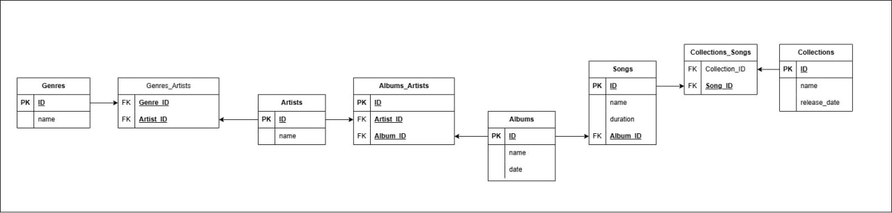

# Музыкальная база данных (SQL)

## Описание

Учебный проект — реляционная база данных музыкального сайта.
Хранит информацию о жанрах, исполнителях, альбомах, треках и сборниках.

## Схема

## Структура

Основные таблицы:

- genres
- artists
- albums
- songs
- collections

Таблицы связей:

- genres_artists
- albums_artists
- songs_collections

## Связи

- жанры ↔ исполнители — многие ко многим
- исполнители ↔ альбомы — многие ко многим
- альбомы → треки — один ко многим
- треки ↔ сборники — многие ко многим

## Данные

База заполнена тестовыми данными так, чтобы все SELECT-запросы возвращали результат.

## Запросы

Реализованы запросы:

- альбомы с исполнителями более одного жанра;
- треки, не входящие в сборники;
- исполнители с самым коротким треком;
- альбомы с минимальным количеством треков;
- средняя длительность треков по альбомам;
- исполнители без альбомов в 2020 году.

## Технологии

- PostgreSQL
- SQL (JOIN, GROUP BY, HAVING, EXISTS)

## Статус

Проект выполнен и соответствует ТЗ.
